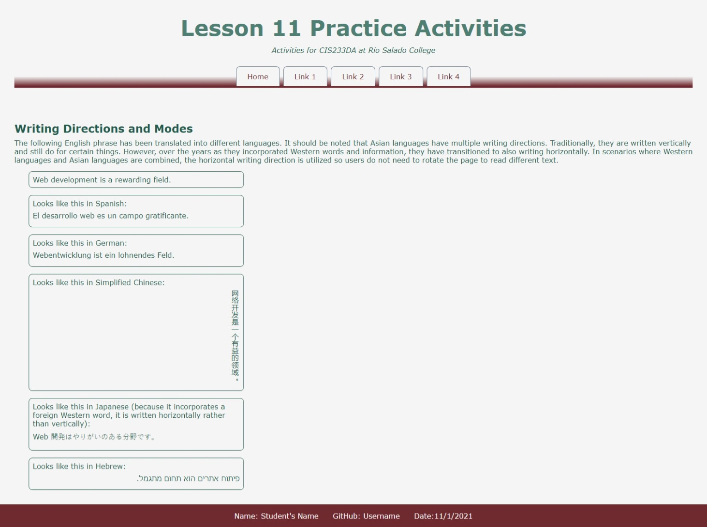

# Internationalization Activity
In this activity, you will modify a web page to work with a different reading direction.

## Activity Objectives
1. Utilize the BDI element to isolate content in other languages.
2. Change the direction and writing mode for certain languages.
3. Apply additional styles to elements.

## HTML Directions
1. Open the `index.html` file. 
2. Update the metadata to appropriate values.
3. Update the information within the footer with your information.
4. Save and apply a commit to the file.

### Isolate Foreign Languages
With the index.html file open:

1. For the `example` div element:
   1. Tell translation tools to not translate the content in the element by applying the `translate` attribute to the element with a value of `no`.
2. In the last 5 paragraphs in the `example` div element:
   1. Surround the text after the colon in a `bdi` element.
   2. Add the `lang` attribute to the `bdi` elements with the appropriate values:
      1. `es` for Spanish.
      2. `de` for German.
      3. `zh-CN` for Simplified Chinese.
      4. `ja` for Japanese.
      5. `he` for Hebrew.
3. Save and apply a commit to the file.

## Styling the Languages
Use any appropriate selectors and property-value pairs to style the web pages and elements. Keep in mind the cascade, specificity, and inheritance as you apply properties to the various elements.

Add the styles after the `Add International styles below this comment`.

1. Style the `bdi` element as follows:
   1. Change the display to be `block` - to make it appear on its own line.
   2. Set the width to be the full width of the container.
   3. Add a top and bottom padding of .5rem and no left and right padding.
2. Style the Simplified Chinese `bdi` element as follows: *Hint: Use an attribute selector.*
   1. Set the writing mode to be vertical right to left.
3. Style the Hebrew `bdi` element as follows:
   1. Set the direction to be right to left.
4. Save and apply a commit to the file.

The following image is an example of what the figure should look like after adding the styling and content to the page. Hover over the element to see the figure caption appear. Resize your browser window to see the image swap out and change based upon the picture element.

## Conclusion
When you are done with the activity:
1. Be sure you check for any validation, spelling, and grammar errors and correct them.
2. Sync the files (i.e., push your changes) with the remote repo on GitHub.
3. Publish your repo using GitHub Pages.
