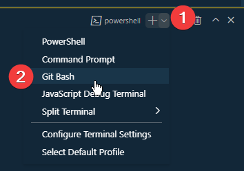

# Command Line Interface Activity
In this activity, you will modify a web page and then use the command line to apply a commit message and push your changes to the repo on GitHub.

## Activity Objectives
1. Edit a web page.
2. Apply a commit using the command line.
3. Push changes using the command line.

## HTML Directions
1. Open the `index.html` file. 
2. Save a copy of the file with the name of `cli.html` within the root of the repo. (i.e., the same location that the `index.html` file is located.)
3. Remove the content from the `main` element.
4. Save the file. Do not apply a commit as you will do that in the next section.
5. Add the following to the `main` element:
   1. A level two heading with the text: `Git Information`
   2. Create an unordered list with the following: *The information in curly brackets will need to be filled in as you complete the Git Commands section of the project below.*
      1. Git Version: {Version}
      2. Git Remote Server: {Server}
      3. Active Branch Name: {Name}
      4. Git Status: {status message}
   3. Create a level two heading with the text: `Git Commands`
   4. Add the following after the heading as a table: *Remember to use the `code` element for the content in the Command and Example columns.*

| Action | Command | Example | Notes |
| ------ | ------- | ------- | ----- |
| Determine Version | `git --version` | - | The version will appear where you typed. |
| List Branch names | `git branch` | - | In a list of multiple branches, the branch with an asterisk is the active branch. |
| Determine remote server URLs | `git remote -v` | - | This will show the URLs for the remote repo along with the name of the repo (origin by default). |
| Check status of files | `git status` | - | This will compare your local files to the remote repo and let you know if there are differences |
| Stage changes before committing | `git add <file>` | `git add css/styles.css` | Be sure to include the folder if the file is in a subfolder. |
| Apply changes to a commit | `git commit -m "<message>"` | `git commit -m "created css file"` | This will create a commit with the message in quotes. |
| Push Changes to remote | `git push` | - | This will upload any changes from your local repo and merge them with the remote repo. |
| Pull Changes from remote | `git pull` | - | This will download any changes from the remote repo and merge them with the local repo. |
| Cloning a repo | `git clone <URL>` | `git clone https://github.com/rsc-cis233da-in-v8/CIS233DA-Course-Resources.git` | This will create a folder and clone the repo in the local folder you are currently in. |

6. Save the file. Do not apply a commit as you will do that in the next section.

## Git Bash Terminal
Now we will use the command line to look at some Git properties, stage changes to be ready to commit them, apply a commit, and then push the changes.

1. Open the Terminal in VS Code. This can be done using the `View` menu and selecting the `Terminal` option from the drop down.
2. Depending on how you have your system set up, you may need to switch to the Git Bash interface. 
   1. In the upper right corner of the Terminal pane, look for the Terminal type. It may say Command, PowerShell, Bash, or something else. If it says anything other than Bash, click the plus button in the upper right corner and select `Git Bash`. 

This is a screenshot of the menu to switch terminals within the Terminal pane.

3. Once the Git Bash terminal appears, you should see a dollar sign where you can type in commands.

### Getting Information
In the Git Bash terminal, complete the following commands to get information that you can then add to the unordered list in the appropriate areas.

1. Type in the command `git --version` and press Enter.
   1. You should see the version of the Git application you have installed.
   2. Type in the value within the unordered list in the HTML file.
2. Type in the command `git branch` and press Enter.
   1. A list of all the branches will appear - it should only have one in this instance.
   2. Type in the name of the branch into the unordered list.
3. Type in the command `git remote -v` and press Enter.
   1. You should see two lines appear - one for fetch and one for push.
   2. Copy the URL for the push line to the unordered list.
4. Type in the command `git status` and press Enter.
   1. You should see a status showing changes that are not staged.
   2. List the files under the "Changes not staged for commit" within the unordered list.
5. Save your HTML file.

### Staging, Committing, and Pushing Changes
Now you will stage your changes, commit them, and then push the changes to GitHub using the Terminal.

1. Type in the command `git add <file>`, replacing `<file>` with the file name as listed in the status message you viewed earlier. Press Enter. This will stage your changes ready to be added to a commit.
2. Type in the command `git commit -m "added content to the cli.html file"` and press Enter. This will create a commit with the message in quotation marks.
3. Check the status of your repo again to make sure all changes have been committed. The status should say the branch is ahead of 'origin/main' by a number of commits.
4. Type in the command `git push` and press Enter. This will upload your changes to GitHub.
5. Check the status. The status should say the branch is up to date with 'origin/main'.

## Styling the list and Table
Use any appropriate selectors and property-value pairs to style the web pages and elements. Keep in mind the cascade, specificity, and inheritance as you apply properties to the various elements.

Add the styles after the `Add CLI styles below this comment`.

1. Style the list as follows:
   1. Add whitespace before and after each list item.
   2. Change the list style type to something other than the default marker.
2. Style the table as follows:
   1. Set the width to be 90%.
   2. Set the margins to auto to center it on the page.
   3. Collapse the borders.
3. Style the table header cells as follows:
   1. Apply a thick bottom border with a color of your choosing.
   2. Center the text within the cell.
4. Style the table rows as follows:
   1. Every other row of the table should have a different colored background.
   2. Add a thin solid border with a color of your choosing to the top and bottom.
5. Style the table cells as follows:
   1. Add padding to all sides of `1rem`.
6. Apply any additional styles that you feel would be appropriate.
7. Save and apply a commit to the file using any method you prefer.

## Conclusion
When you are done with the activity:
1. Be sure you check for any validation, spelling, and grammar errors and correct them.
2. Sync the files (i.e., push your changes) with the remote repo on GitHub.
3. Publish your repo using GitHub Pages.

> NOTE: You can learn more about Git commands by referring to the [Pro Git book](https://git-scm.com/book). It is recommended you bookmark this site for future reference to refer to in case you need to perform more advanced functions with Git.